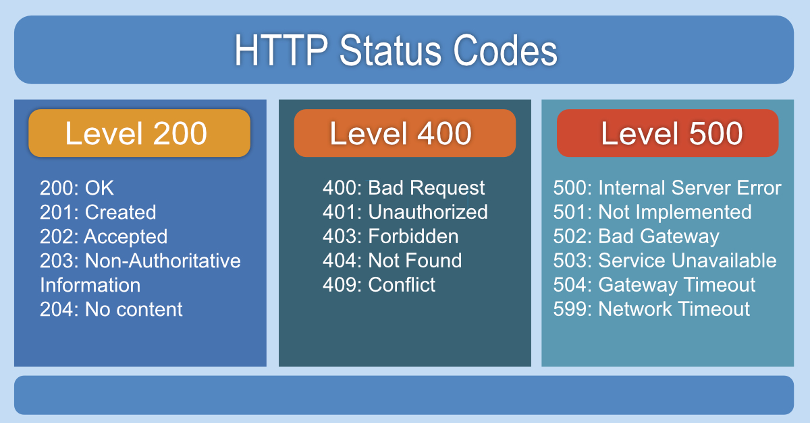

# Routing in Express

### 1. What is Routing?

Routing refers to how an application responds to client requests to specific endpoints (URIs) using HTTP methods (GET, POST, etc.). In Express, routing involves defining:

- HTTP Method (GET, POST, PUT, DELETE, etc.)
- Path (URL or URI)
- Handler Function (Logic to execute when the route is matched)

### 2. Basic Route Structure

`app.METHOD(PATH, HANDLER);`
`METHOD`: HTTP method (e.g., `app.get()`, `app.post()`).
`PATH`: URL path (e.g., `/users`, `/posts/:id`).
`HANDLER`: Function executed when the route is matched.

## HTTP Methods

- `GET`: Retrieve data.

- `POST`: Submit data.

- `PUT`: Update data.

- `DELETE`: Delete data.

- `PATCH`: Partial update.

- `ALL`: Handle all methods for a path.

## 4. Route Paths

Paths can be static or dynamic using route parameters (:param).

### Static Path:

```
app.get('/about', (req, res) => {
  res.send('About Page');
});
```

### Dynamic Path with Parameters:

```
app.get('/users/:userId', (req, res) => {
  res.send(`User ID: ${req.params.userId}`);
});
```

## Express Router

1. Create a Router File `(routes/route.js)`

```
const express = require('express');
const router = express.Router();

```

2.  Mount the Router in `server.js`

```
const userRoutes = require('./routes/users');
app.use('/users', userRoutes); // Routes start with /users
```

## HTTP Status Code



```
200 OK: Successful GET/PUT requests.

201 Created: Resource created successfully (POST).

204 No Content: Successful DELETE (no response body).

400 Bad Request: Invalid client input (e.g., missing data).

401 Unauthorized: Authentication failed.

404 Not Found: Resource doesn’t exist.

500 Internal Server Error: Unexpected server error.
```
